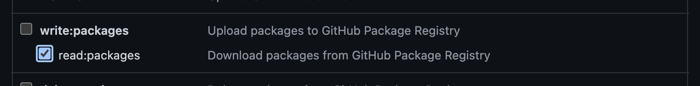

# app

## Project Setup

1. Install [Yarn v1](https://yarnpkg.com/getting-started/install)
2. Install [nvm](https://github.com/nvm-sh/nvm#installing-and-updating)
3. Clone this repository
4. Create a [Github Token](#github-token)
5. Create a [.npmrc file](#npmrc) file
6. Create a [.env](#env) file
7. Create a [sentry.properties](#sentry) file

## Github Token

Visit the [Github Token page](https://github.com/settings/tokens/new) and create a new token.
Give access to `read:packages`.



## NPMRC

Copy the `.npmrc.example` and rename it to `.npmrc` (ignored in git).
Replace `GITHUB_TOKEN` with your newly created token.

> The `.npmrc` file is required to allow access to private GitHub packages.

## ENV

Copy the `.env.example` and rename it to `.env` (ignored in git).
Add your values to the new file.

## Sentry

Copy the `sentry.properties.example` and rename it to `sentry.properties` (ignored in git).
Add your values to the new file.

> The `.env` file is required to allow access to different services.

## Install packages

Make sure to call `nvm use` before proceeding.
(Check [nvm's docs on deeper shell integration](https://github.com/nvm-sh/nvm#deeper-shell-integration)
to learn how to call `nvm use` automatically)
Alternatively you can check the `.nvmrc` file and ensure that you're using the correct node version.

```
cd path/to/dekk/app
nvm use
yarn install
```

## Develop

To start developing start the next.js development script and open http://localhost:3000

```sh
yarn dev
```
